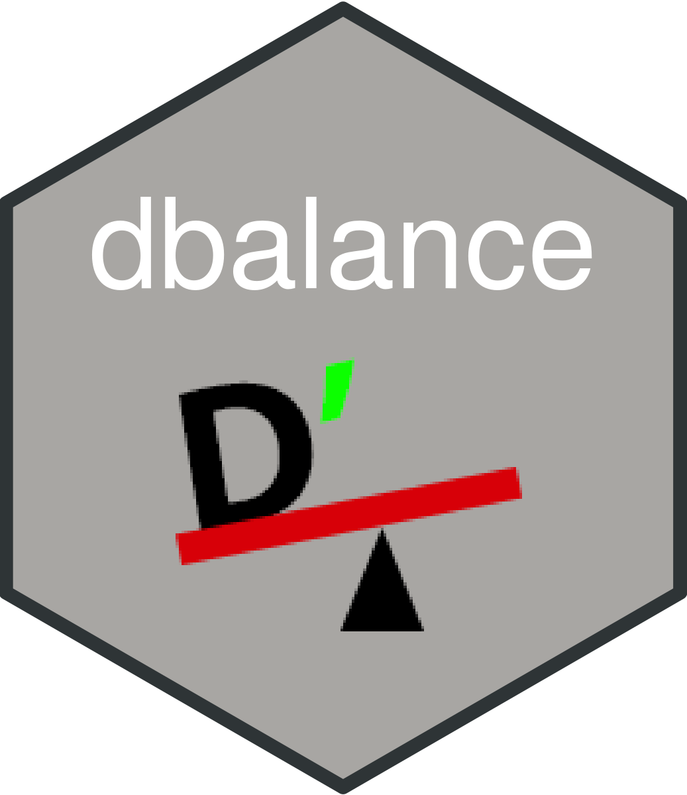

<!-- README.md is generated from README.Rmd. Please edit that file -->

# dbalance

<div style="text-align: center">



</div>

<!-- badges: start -->
<!-- badges: end -->

Originally developed as my final exam for KIN 697u at the University of
Massachusetts Amherst. {dbalance} calculates critical speed and D’ based
on on previous personal records and performs race simulation via the
D’-balance model.

## Installation

You can install a more stable version from my `drat` repository:

``` r
# install.packages("drat")
drat::addRepo("brentscott93")
install.packages("dbalance")
```

You can install the development version of dbalance like so (note this
will install from latest commit in this repo):

``` r
# install.packages("devtools")
devtools::install_github("brentscott93/dbalance)
```
